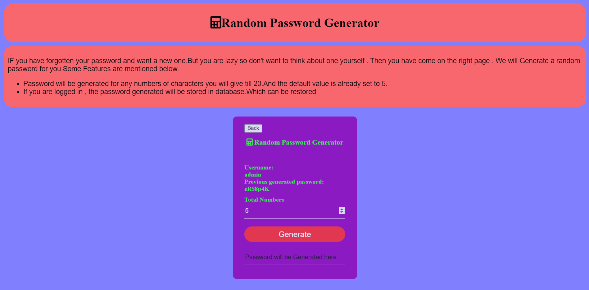
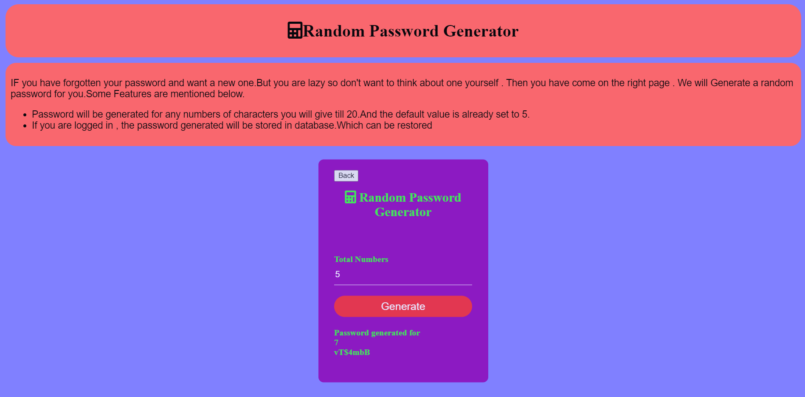

# Random Password Generator
This is a Random Password Generator which uses MySQL and Springboot Framework and runs on Java Eclipse IDE 

# This Readme Contains
* [Features of the program](#features)
* [Requirements to run it](#requirements)
* [Steps to run it](#steps)
* [Images of Working model](#screenshots)
* [Drawbacks](#drawbacks)

## Features
1. You can get a Random Generated Password from password length 5 to 20.  
2. There is a Login System for the user using this application.
3. The last random password generated is stored in the database and gets overwritten when a new password is generated. 

## Requirements
1. Java jdk-15 
2. Eclipse IDE for Java Developers 2021-06  
3. Maven Dependencies from 2021-06 - https://download.eclipse.org/releases/2021-06/ (if it's not already installed) 
4. Xampp 

## Steps
1. Run Apache and MySQL Server on Xampp 
2. Create a new database named oopm 
3. Create two tables i.e userinfo and randomp 
4. userinfo will have 3 columns i.e userid (Primary key) , username and password 
5. randomp will have 3 columns i.e id (Primary key), userid (Foreign key) and pword 
6. Enter data in those two tables. 
7. In Eclipse, right click on rpgapplication.java  
8. Run it as Java Application  
9. Note the port number on which Tomcat server has started  
10. Enter the url http://localhost:port_number  
11. Login and then generate random password. 

## Screenshots

## Drawbacks
* There is no registration system. It has to be done some other way.
* Once you forget your login password, there's no other way to retrieve it and thus you won't be able to use this application